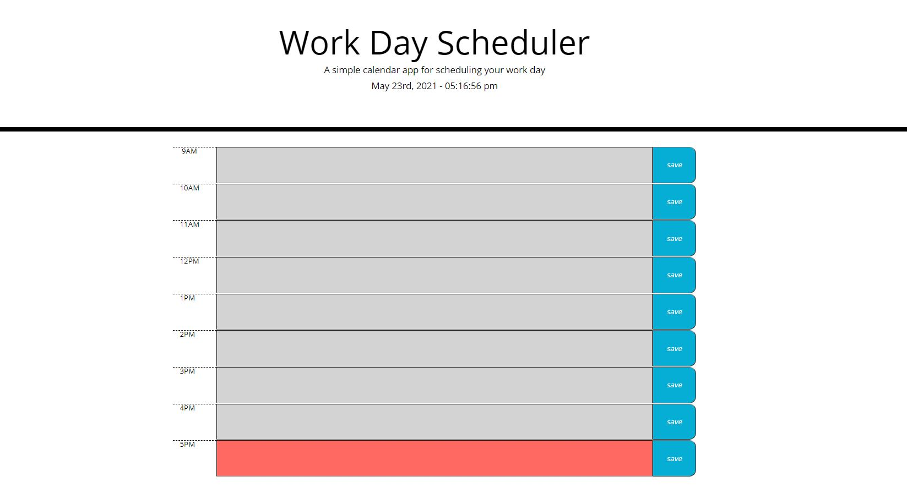

# Daily Planner

**Version 1.0.0**

## Test Your Knowledge

    This application was designed to provide a daily planner for work days. During non work hours the display will be all white but during work hours the page will be responsive to time each time it refreshes. Users are able to use local storage to save their inputs. 

## Img

   

## Built With...

    JAVASCRIPT
    HTML
    CSS

    BOOTSTRAP
    JQUERY
    MOMENT.JS

## Contributor

    Richie Tauch

## Website Link

[Daily Planner](https://rumtikitum.github.io/DailyPlanner/)